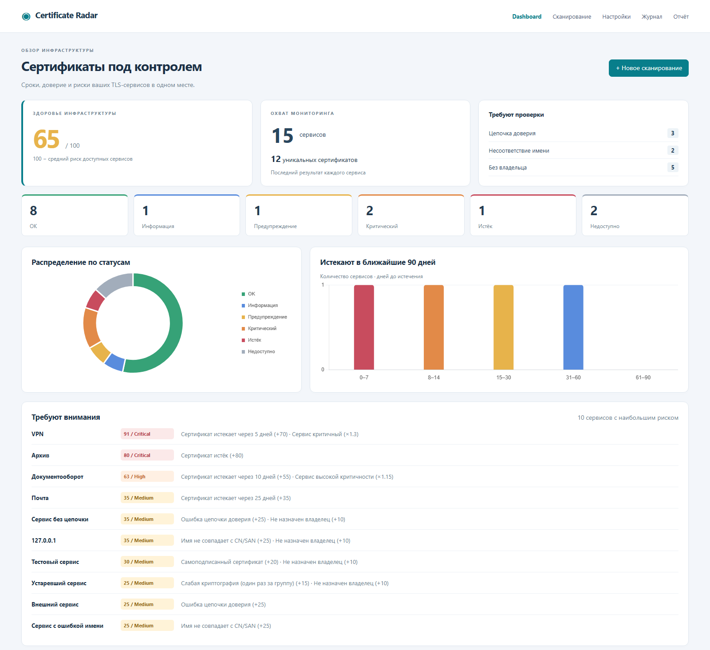

# Certificate Radar

**Обнаружить проблему с TLS-сертификатом до того, как она станет инцидентом.**

Локальное веб-приложение для инвентаризации TLS-сертификатов. Оно получает список DNS-имён, IP, URL или подсетей, подключается к TLS-сервисам и показывает сроки, ошибки доверия, несоответствие имени, слабую криптографию, объяснимую оценку риска и ответственных. Уведомления приходят в Telegram, Email или Teams, отчёты выгружаются в Excel и PDF. Интерфейс и рекомендации — на русском языке.

Проект хакатона KGM · автор: Мұқажан Тайыр (CS-204(c), [iwbhappy](https://github.com/iwbhappy))



**Разделы:** [Проблема](#проблема) · [Возможности](#возможности) · [Соответствие ТЗ](#соответствие-тз) · [Быстрый старт](#быстрый-старт) · [Демо](#демо-за-5-шагов) · [Как это работает](#как-это-работает) · [Безопасность и ограничения](#безопасность-и-ограничения) · [Тесты](#тесты) · [Документы](#документы-проекта)

---

## Проблема

Истёкший сертификат — это остановка сервиса: браузер показывает ошибку, приложения и интеграции не подключаются.

- **Нет единого реестра.** Сертификаты разбросаны по порталам, VPN, почте и внутренним сервисам.
- **Проверки вручную.** Сроки, цепочку доверия и имена в SAN проверяют, когда вспомнят.
- **Узнаём последними** — от пользователя или звонка в поддержку.

Проблема растёт: CA/Browser Forum сокращает срок публичных сертификатов — 200 дней с марта 2026, 100 дней с 2027, 47 дней с 2029. Из-за истёкших сертификатов уже случались крупные сбои: O2 и Ericsson (2018), Microsoft Teams (2020).

## Возможности

**По ТЗ:**
- Ввод целей: DNS, IP, `host:port`, URL, IPv6, подсети CIDR, TXT и CSV.
- TLS-подключение (порт 443 и любые заданные), получение сертификата и его атрибутов.
- Срок действия и Days Left; статусы OK / Information / Warning / Critical / Expired (+ ERROR), пороги настраиваются.
- Проверки: истёк, скоро истекает, самоподписанный, цепочка доверия, несоответствие имени CN/SAN.
- Dashboard: KPI, графики, фильтры и сортировка по сервису, владельцу, издателю, сроку и статусу.
- Уведомления на порогах 60 / 30 / 14 / 7 / 1 день без повторов.
- Экспорт: CSV, Excel, печатный отчёт / PDF.
- Журнал действий, режим «только чтение», секреты не хранятся в БД.

**Сверх ТЗ:**
- **Объяснимый Risk Score 0–100** с причинами и рекомендациями.
- **Владелец и критичность сервиса** (CSV или интерфейс), риск пересчитывается сразу, без повторного скана.
- **Слабая криптография:** RSA < 2048, EC < 256, подпись SHA-1/MD5, TLS 1.0/1.1.
- **Детальная диагностика цепочки:** самоподписанный, недоверенный корень, неполная цепочка с подсказкой про промежуточный сертификат.
- **Корпоративные корневые CA** — загрузка в интерфейсе.
- **История сканов:** видно, когда сертификат заменили.
- **Индекс здоровья инфраструктуры** = 100 − средний риск.
- **Полностью офлайн** (без CDN) и **локальный TLS-стенд** с 13 сценариями для демонстрации.

## Соответствие ТЗ

| п. ТЗ | Требование | Реализация | Статус |
|---|---|---|---|
| 3.3 | Список серверов / IP / DNS / URL / диапазонов, порт 443 | `app/parser.py`, страница `/scan`, CSV с владельцами | ✅ |
| 3.4 | Основные атрибуты сертификата | CN, SAN, издатель, серийный номер, Thumbprint SHA-1, SHA-256, срок, ключ, подпись, TLS, IP — карточка сервиса, API, экспорт | ✅ |
| 3.5 | Пять статусов, настраиваемые пороги | OK / Information / Warning / Critical / Expired + ERROR; пороги в `/settings`, пересчёт без скана | ✅ |
| 3.6 | Истёкший / скоро истекает / self-signed / цепочка / имя | реестр проверок `app/analysis/checks.py` | ✅ |
| 3.7 | Dashboard, фильтры и сортировка | KPI, 2 графика, топ-10 по риску, таблица с фильтрами и сортировкой по любой колонке | ✅ |
| 3.8 | Уведомления 60/30/14/7/1 | Telegram (проверен вживую), Email, Teams; дедупликация | ✅ |
| 3.9 | Оценка риска с причинами | Risk Score 0–100, каждое слагаемое объяснено | ✅ |
| 3.11 | Экспорт отчёта | CSV (UTF-8 BOM), Excel на 3 листа, HTML-отчёт для печати в PDF | ✅ |
| 4.1 | Модульная архитектура | сборщики, реестр проверок, экспортёры, каналы уведомлений — отдельные модули | ✅ |
| 4.2 | Read-only, без хранения паролей, журнал | только TLS-рукопожатие; секреты в `.env`; журнал в БД и `logs/audit.log` | ✅ |
| 4.3 | Понятный интерфейс, пороги, экспорт | русский интерфейс, настройки, экспорт | ✅ |

---

## Быстрый старт

**Нужно:** Windows 10/11 или Linux, Python 3.11+ в `PATH`. Интернет — только при первой установке зависимостей.

Windows (PowerShell):

```powershell
git clone https://github.com/iwbhappy/Hackaton_KGM.git
cd Hackaton_KGM
.\run.bat
```

Linux:

```sh
git clone https://github.com/iwbhappy/Hackaton_KGM.git
cd Hackaton_KGM
sh run.sh
```

Откройте **http://127.0.0.1:8000**. Скрипт сам создаёт `.venv`, устанавливает зависимости, создаёт базу `data/radar.db` и запускает сервер. Повторный запуск при тех же зависимостях не обращается к интернету. Остановка — Ctrl+C.

Файл `.env` необязателен: он нужен для уведомлений и смены адреса (см. [Настройки](#настройки-env)). Проверено на Windows с Python 3.13; на Linux запуск через `run.sh` не проверялся.

## Демо за 5 шагов

Демо использует локальный TLS-стенд: 13 сервисов с разными проблемами плюс подсеть, всего 15 целей.

**1. Запустите приложение** (терминал 1):
```powershell
.\run.bat
```

**2. Создайте сертификаты стенда и запустите его** (терминал 2):
```powershell
.venv\Scripts\python.exe -m lab.generate_certs
.venv\Scripts\python.exe -m lab.lab_server
```
Стенд слушает `127.0.0.1:443`. Если не хватает прав на порт 443, стенд сам перейдёт на 8443. Если порт 443 занят другой программой, запустите стенд с `--port 8443`. В обоих случаях добавьте `:8443` к демо-целям. На Linux используйте `.venv/bin/python`.

**3. Добавьте имена стенда в hosts** (PowerShell **от администратора**, один раз, из папки проекта):
```powershell
cd C:\путь\к\Hackaton_KGM
Add-Content -Path C:\Windows\System32\drivers\etc\hosts -Value ("`r`n" + (Get-Content .\lab\hosts.txt -Raw))
ipconfig /flushdns
```
На Linux добавьте строки из `lab/hosts.txt` в `/etc/hosts`. Приложение и генератор системные файлы не меняют.

**4. Загрузите владельцев:** откройте http://127.0.0.1:8000/scan → «Вставить демо-CSV с владельцами» → «Применить сведения из списка / файла».

**5. Сканируйте:** «Вставить демо-список» → «Сканировать». Через несколько секунд откроется Dashboard.

**Ожидаемые результаты:**

| Сервис | Результат |
|---|---|
| valid, wildcard | OK, цепочка доверена, имя совпадает |
| info / warn / soon | 45 / 25 / 10 дней → Information / Warning / Critical |
| **vpn** | 5 дней, критичный сервис → **риск 91/100 Critical** |
| expired | Expired, истёк 5 дней назад |
| selfsigned | Самоподписанный сертификат |
| untrusted | Выпущен недоверенным CA (Rogue Issuer Ltd) |
| nochain | Сервер не отдаёт промежуточный сертификат |
| mismatch | Сертификат выписан на другое имя |
| weak | RSA 1024 + SHA-1 |
| dead, 127.0.0.2 | Недоступен (ERROR) |
| 127.0.0.1 (из подсети) | Скан по IP: сертификат по умолчанию, имя не совпадает |

**Что показать дальше:** фильтры по статусу, владельцу и издателю; карточки nochain, mismatch и weak; назначение владельца у nochain (риск 35 → 25 без повторного скана); «Отправить уведомления»; «Экспорт» → Excel; «Отчёт» → «Печать / PDF»; `/settings` и журнал `/audit`.

**Повторная демонстрация.** Остановите приложение и стенд, заново выполните `python -m lab.generate_certs`, удалите `data/radar.db*`, запустите всё снова. Без свежих сертификатов у vpn будет 4 дня вместо 5. Без очистки базы уже отправленная сводка после скана не придёт повторно; кнопка «Отправить уведомления» отправляет её в любом случае.

**Без hosts** можно проверить один сервис из командной строки:
```powershell
.venv\Scripts\python.exe -m app.collectors.tls_collector soon.lab.local --connect-host 127.0.0.1
```

Резервный список публичных целей (нужен интернет): `lab/targets_public.txt`.

---

## Как это работает

```text
Текст / TXT / CSV / CIDR
          │ parser.py → Target
          ▼
TLSCollector (два TLS-подключения)
          │ сертификат, версия TLS, IP, вердикт о доверии
          ▼
analysis: cert_parser → hostname → checks → status → risk
          │
          ▼
scanner → SQLite (data/radar.db, история сканов)
          │
          ├── FastAPI JSON API → Dashboard (Jinja2 + JS + локальный Chart.js)
          ├── exporters → CSV / Excel / HTML для печати
          ├── notifiers → Telegram / Email / Teams, дедупликация
          └── audit → БД + logs/audit.log
```

**Два TLS-подключения к каждой цели.** Первое принимает любой сертификат — истёкший, самоподписанный, со слабым ключом — и забирает его для анализа. Второе строгое: OpenSSL проверяет цепочку по системному хранилищу (на Windows — хранилище Windows) и загруженным корпоративным CA. Если строгая проверка отклонила сертификат только из-за устаревшего TLS или слабой криптографии, доверие перепроверяется в режиме совместимости, а слабая криптография показывается отдельными проверками.

**Цепочка доверия.** Коды OpenSSL переводятся в диагноз: 18 — самоподписанный, 19 — недоверенный корень, 20/21 — неполная цепочка или недоверенный CA (с подсказкой про промежуточный сертификат при наличии AIA), 10 — истёк, 9 — ещё не действителен.

**Имя сервиса** проверяется по RFC 6125: при наличии SAN поле CN не используется; wildcard покрывает ровно один уровень имени; IP сверяется с IP в SAN.

**Статус зависит только от срока:** OK > 60 дней, Information 31–60, Warning 15–30, Critical 0–14, Expired < 0, ERROR — сертификат не получен. Остальные проблемы отражаются в Issues и Risk Score.

**Risk Score:**
- срок: истёк 80 · 0–7 дн. 70 · 8–14 дн. 55 · 15–30 дн. 35 · 31–60 дн. 15;
- самоподписанный +20 **или** ошибка цепочки +25 (берётся одно);
- несовпадение имени +25; слабая криптография +15 (один раз на группу); нет владельца +10;
- множитель критичности: low 0.85 · normal 1.0 · high 1.15 · critical 1.3;
- итог `min(100, round(сумма × множитель))`: 0–19 Low, 20–49 Medium, 50–79 High, 80–100 Critical.

**Пример:** VPN истекает через 5 дней (+70), сервис критичный (×1.3): 70 × 1.3 = **91 → Critical**. Каждое слагаемое показано в карточке сервиса.

**Расширение.** Новая проверка — функция `check(result, endpoint, settings) -> Issue | None` в `app/analysis/checks.py` и строка в списке `CHECKS`. Новый источник данных реализует `BaseCollector`, новый канал уведомлений — `BaseNotifier`.

### Структура репозитория

```text
app/              приложение
  collectors/     сбор TLS
  analysis/       разбор сертификата, имя, проверки, статус, риск
  api/            JSON API
  exporters/      CSV, Excel, HTML-отчёт
  notifiers/      Telegram, Email, Teams, дедупликация
  templates/      страницы интерфейса
  static/         CSS, JS, Chart.js
lab/              тестовый стенд: генератор сертификатов, TLS-сервер, списки целей
tests/            автотесты pytest
scripts/          установка зависимостей
docs/pitch/       материалы защиты
```

### API

JSON API используется интерфейсом и подходит для интеграций. Основные маршруты: `POST /api/scans`, `GET /api/results`, `GET /api/summary`, `GET/PATCH /api/endpoints/{id}`, `GET/PUT /api/settings`, `GET /api/export/csv`, `GET /api/export/xlsx`, `GET /api/audit`, `GET /health`. Полный список — в `SPEC.md`, раздел 7, и в `/openapi.json`. Интерактивная страница `/docs` загружает Swagger UI с CDN и поэтому работает только с интернетом.

---

## Уведомления

Реквизиты задаются только в `.env`, после изменения приложение нужно перезапустить:

- **Telegram:** `TELEGRAM_BOT_TOKEN`, `TELEGRAM_CHAT_ID`. Бот должен иметь доступ к чату.
- **Email:** `SMTP_HOST`, `SMTP_PORT` (587), `SMTP_USER`, `SMTP_PASSWORD`, `SMTP_FROM`, `SMTP_TO`. Обязателен STARTTLS с проверкой сертификата сервера.
- **Teams:** `TEAMS_WEBHOOK_URL` (Incoming Webhook, MessageCard).

После каждого скана на канал уходит одна сводка. Для каждого сертификата выбирается наименьший достигнутый порог из 60/30/14/7/1 (для истёкших — 0). Ключ дедупликации — «отпечаток сертификата + порог + канал»: про каждый порог приходит одно сообщение, после замены сертификата отсчёт начинается заново. Кнопка «Отправить уведомления» отправляет текущую сводку без учёта дедупликации. Ошибка отправки не прерывает скан и видна в интерфейсе и журнале.

На `/settings` видно, какие каналы настроены (значения маскированы), для каждого есть кнопка «Тест».

**Проверка:** Telegram проверен с реальным ботом. Email и Teams проверены автотестами с подменённым транспортом; для реальной отправки нужны реквизиты.

## Настройки (`.env`)

```powershell
Copy-Item .env.example .env
```

- `HOST`, `PORT` — адрес и порт (по умолчанию `127.0.0.1:8000`). Для показа с другого устройства: `HOST=0.0.0.0` и `PUBLIC_URL=http://<IP компьютера>:8000`.
- `DATA_DIR`, `LOG_DIR` — каталоги базы и журналов (относительные пути — от корня проекта).
- Реквизиты уведомлений — см. выше.

Пороги статусов и уведомлений, параллельность, таймаут и лимиты меняются в интерфейсе на `/settings`. Там же загружаются корпоративные корневые CA (PEM/CRT/CER; DER конвертируется в PEM; принимаются только корневые CA, закрытые ключи отклоняются).

### Установка без интернета

Chart.js хранится в репозитории (`app/static/vendor/`), CDN и внешних шрифтов нет, поэтому сканирование и отчёты работают без интернета. Чтобы и установка прошла офлайн, на машине с интернетом подготовьте пакеты для той же ОС, архитектуры и версии Python:

```powershell
python -m pip download -r requirements.txt -d wheelhouse
```

Скопируйте проект вместе с папкой `wheelhouse/` — `run.bat` / `run.sh` установит пакеты из неё. Папка `wheelhouse/` в Git не хранится.

---

## Безопасность и ограничения

**Безопасность:**
- К целям выполняется только TLS-рукопожатие: без HTTP-запросов, логинов и изменений на серверах.
- Секреты хранятся только в `.env`, не записываются в БД и маскируются в интерфейсе и журналах. `.env`, база, журналы и ключи стенда исключены из Git.
- По умолчанию приложение доступно только с `127.0.0.1`.
- Все действия пишутся в журнал: сканы, изменения, выгрузки, уведомления, загрузка CA.
- Лимиты: файл до 1 МБ, до 2048 целей за скан, подсеть до 1024 адресов (настраивается).
- Пользовательский ввод экранируется; ячейки CSV/Excel не исполняются как формулы.
- Скан рабочих подсетей стоит заранее согласовать со службой ИБ (SOC).

**Ограничения MVP:**
- нет проверки отзыва сертификатов (OCSP/CRL);
- нет STARTTLS (SMTP 25/587, LDAP 389) — проверяется только прямой TLS;
- нет авторизации пользователей — запускать в доверенной сети;
- нет автоскана по расписанию; можно вызывать `POST /api/scans` с `{"rescan_all": true}` из Планировщика заданий;
- одновременно выполняется один скан; SQLite рассчитана на один экземпляр приложения;
- не реализованы опциональные пункты: редактирование весов риска в интерфейсе, экспорт с учётом фильтров, `/metrics` для Prometheus, скрипт для IIS.

## Тесты

```powershell
.venv\Scripts\python.exe -m pytest -q
```

**117 тестов.** Тесты сами поднимают TLS-стенд на свободном порту, поэтому не требуют hosts, порта 443 или интернета. Покрыты: разбор целей, проверка имени, реальные TLS-подключения ко всем сценариям стенда, статусы, каждая проверка, Risk Score (включая VPN = 91), API, владельцы, экспорт, CA, журнал и дедупликация уведомлений. `tests/test_demo.py` дважды проходит весь демо-сценарий на чистой базе и проверяет, что 50 целей сканируются быстрее 15 секунд (на стенде — около 2 секунд).

Только интеграционные TLS-тесты: `pytest -m lab -q`.

## Документы проекта

- [`SPEC.md`](SPEC.md) — техническое задание на разработку.
- [`FIXES.md`](FIXES.md) — задание на исправления после код-ревью.
- [`PROGRESS.md`](PROGRESS.md) — журнал выполнения шагов и проверок.
- [`PROJECT_OVERVIEW.md`](PROJECT_OVERVIEW.md) — подробное объяснение проекта простым языком.
- [`docs/pitch/`](docs/pitch/) — материалы защиты: презентация, сценарии выступления, текст к слайдам.

## Развитие

Certificate Radar — первый модуль **Infrastructure Risk Radar**. Та же схема «сборщик → проверки → риск → Dashboard» подходит для других источников: Identity Radar (Active Directory), DNS Radar, Service Radar (доступность), Patch Radar (обновления), Backup Radar (резервные копии).

Ближайшие шаги: скан по расписанию, владельцы из AD и CMDB, SMTP и LDAP через STARTTLS, проверка OCSP/CRL, метрики для Prometheus.
